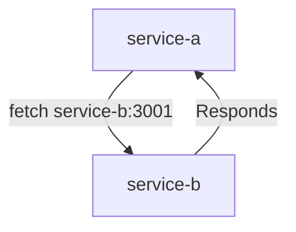

# Micro services for noobs

This repo contains the resources used during a workshop with my students to provide a minimal demonstration of containerization and the use of microservices.

This project illustrate the use of docker with Dockerfiles and docker-compose.yml

## Before or after reading

For a better understanding of this **very minimal** demo project take a look at these ressources :

- https://microservices.io/patterns/index.html : This site is not at all appealing, but these pages on various types of open microservices patterns will allow you to discover new terms you might not know

- https://docker-curriculum.com/ : Docker for beguinners


## Requirements

- Install docker : https://docs.docker.com/engine/install/

## Project Structure

- `./serviceA/`: Contains the files for Service A
- `./serviceB/`: Contains the files for Service B
- `docker-compose.yml`: Docker Compose configuration file

## Dockerfiles

### Service A

```Dockerfile
FROM node:18
WORKDIR /app
COPY package*.json ./
RUN npm install
COPY . .
EXPOSE 3000
CMD [ "node", "server.js" ]
```

### Service B

```Dockerfile
FROM node:18
WORKDIR /app
COPY package*.json ./
RUN npm install
COPY . .
EXPOSE 3001
CMD [ "node", "server.js" ]
```

These Dockerfiles define the environment, copy the necessary files, and run the servers.

## docker-compose.yml

```yml
services:
  service-a:
    build: './serviceA'
    ports:
      - "3000:3000"
    networks:
      - some-net
      
  service-b:
    build: './serviceB'
    ports:
      - "3001:3001"
    networks:
      - some-net

networks:
  some-net:
    driver: bridge
```

This file orchestrates the services and defines a shared network `some-net`.

## Inter-Service Communication

In `serviceA/server.js`, Service A can communicate with Service B using:

```js
await fetch("http://service-b:3001")
```

This is possible because both services are on the same network defined in `docker-compose.yml`.



## Execution

Run the following command to start the services:

```bash
docker-compose up --build
```

## Shutdown

To shut down the services, use:

```bash
docker-compose down
```

## Demo
 
When you call : `GET http://localhost:3000/check-service-b` 

It should respond with `'ok'`

---

**That's all folks !**
